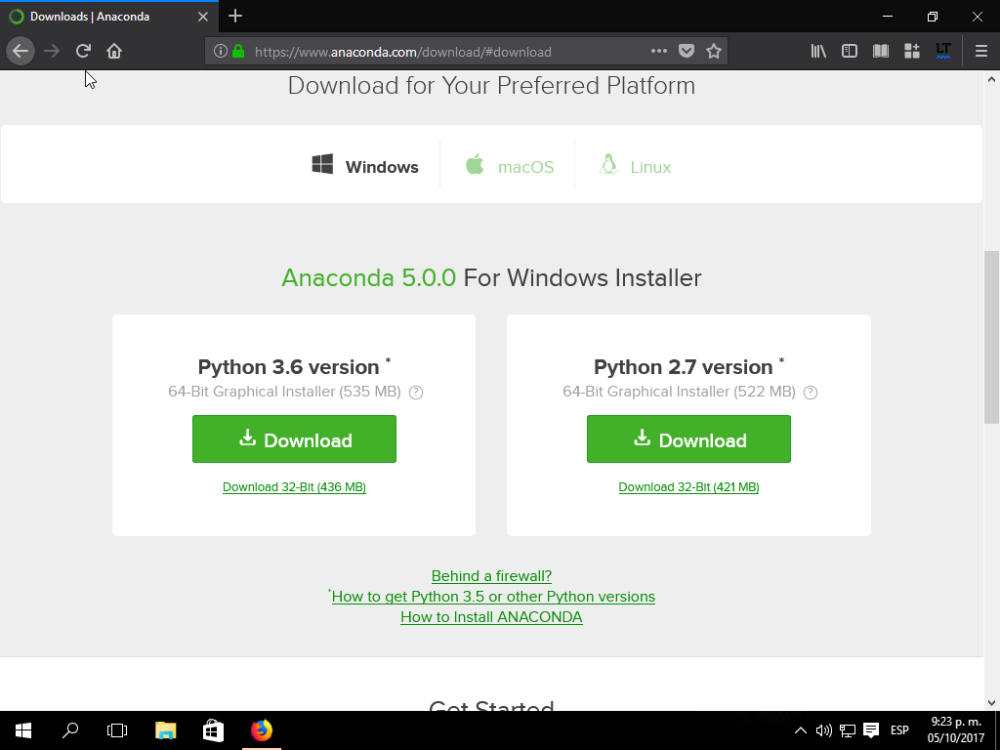
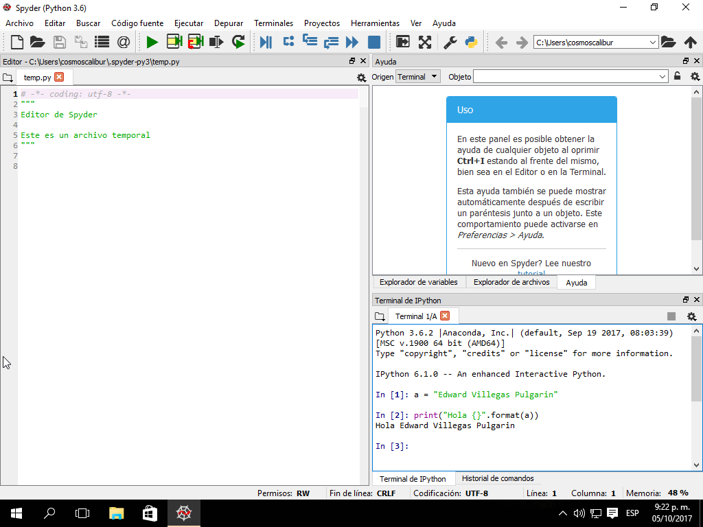
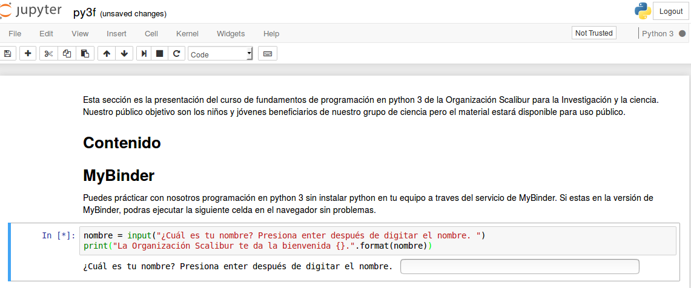

# Usando python

Para proceder a la instalación de python debemos tener en cuenta primero cual es nuestro sistema operativo, procesador de nuestro equipo e incluso disponibilidad de red. Esto es importante pensando en el mejor método para asegurar no solo una fácil instalación de python sino su posterior actualización y la instalación de bibliotecas de código adicionales para usar en python.  

## Versión de python

Te recomendamos instalar python 3 ya que la versión de python 2 ya solo esta en soporte de seguridad y se recomienda activamente a la comunidad que usa python migrar sus códigos a python 3.  

Es importante que sea la versión de python 3 debido a que ambas versiones poseen ligeras diferencias respecto a algunas funciones, sentencias y operaciones. Igualmente, python 3 tiene mejoras en el rendimiento respecto a python 2.  

## Obtener python

Si nuestro sistema operativo es linux, por defecto ya encontrarás python instalado. Igualmente, se recomienda que la instalación de la mayor parte de componentes las realices con el gestor de paquetes de la distribución linux o el gestor `pip`.  

Ahora, este caso mencionado es idóneo si posees también conexión de internet permanente para recurrir continuamente a ella para cada instalación. Si nuestra conexión a internet es solo temporal, se hace conveniente descargar lo que llamaremos una distribución de python. Las distribuciones de python son instaladores que no solo contienen python sino una gran cantidad de bibliotecas de código adicionales. Esto permite una fácil instalación y despreocuparnos de próximas instalaciones, pero debemos sacrificar también una gran cantidad de espacio en disco.  

De las distribuciones existentes, es altamente recomendada la distribución de Anaconda sin importar el sistema operativo que uses. Abré la página de [Anaconda](https://www.anaconda.com/download) y te diriges a la opción de tu sistema operativo. Entre las opciones disponibles, debemos escoger la que diga python 3.6 (3. seguido de un número en general) pero fijate que el texto inferior diga el número de bits asociado a tu procesador (64 bits o 32 bits).  

Ten en cuenta que la descarga es de 510 MB, por lo cual según el ancho de banda puede variar el tiempo de descarga de 10 minutos hasta casi una hora.  



## Instalar python

Ahora que ha terminado la descarga, puedes ejecutar su instalador. El instalador que acabas de obtener ya no requiere de internet y te dejará una gran cantidad de códigos en python listos para usar para creación de interfaces gráficas, cálculos matemáticos, elaboración de gráficos y desarrollo web.  

La instalación es tradiciones, damos doble clic al instalador y damos clic a siguiente (_next_) hasta terminar (sin configurar nada). Cuando el botón diga finalizar (_finish_), retiramos los chulos de las casillas presentes y presionamos finalizar.  

## Ejecutar python

Finalmente probaremos que la instalación haya sido correcta. Esta podría fallar por un fallo en la descarga o porque la instalación resulta muy demandante para nuestro equipo. Si este fue el caso, te recomendamos revisar la opción de miniconda y comentarnos por las instrucciones o usar la versión web que hemos adaptado en [MyBinder](https://beta.mybinder.org/v2/gh/scaliburco/py3f/master).  

En el menú de aplicaciones buscaremos el programa _spyder_ y lo ejecutamos. En la ventana que se abre, usaremos la parte inferior derecha para probar el código mostrado (incluya su propio nombre).  

````python
nombre = "Edward Villegas Pulgarin"
print("Hola {}".format(nombre))
````


Si debes usar la versión de [MyBinder](https://beta.mybinder.org/v2/gh/scaliburco/py3f/master), debes esperar a que cargue y luego seleccionas el archivo `py3f.ipynb`. A continuación en la opción `Cell` debes escoger `Run All`.  



## Fuentes

[_Download Anaconda Distribution_](https://www.anaconda.com/download). Consultado el 5 de octubre de 2017.  

## Actividad

Solucione la actividad __T2A1__ según las indicaciones dadas en el archivo respectivo: [`t2a1q`](../actividades/t2a1q.ipynb).  
